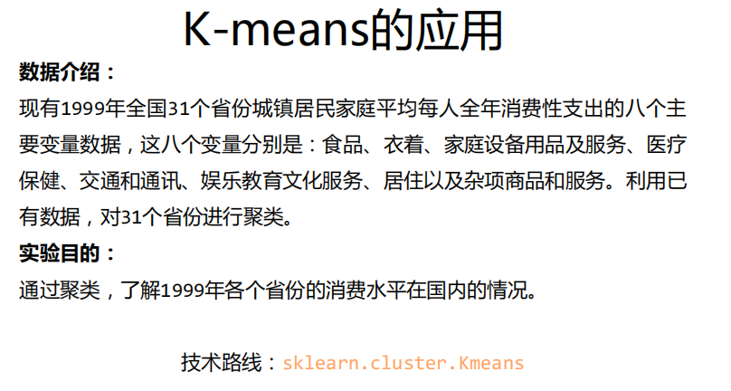

# README

+ 题目背景

    

+ KMeans

    + n_clusters: 用于指定聚类中心的个数
    + init: 初始聚类中心的初始化方法
    + max_iter:最大的迭代次数
    + 一般只用给出n_clusters即可，init默认是k-means++, max_iter默认是300

+ 常用函数

    + strip()

        ```python
        str.strip() #去除字符串两边的空格('\n','\r','\t')
        str.lstrip()#去除左边
        str.rstrip()#去除右边
        #去除指定字符
        str.strip("abc")
        ```

    + split()

        ```python
        >>> u = "www.doiido.com.cn"
         
        #使用默认分隔符
        >>> print u.split()
        ['www.doiido.com.cn']
         
        #以"."为分隔符
        >>> print u.split('.')
        ['www', 'doiido', 'com', 'cn']
         
        #分割0次
        >>> print u.split('.',0)
        ['www.doiido.com.cn']
         
        #分割一次
        >>> print u.split('.',1)
        ['www', 'doiido.com.cn']
        
        #分割两次
        >>> print u.split('.',2)
        ['www', 'doiido', 'com.cn']
         
        #分割两次，并取序列为1的项
        >>> print u.split('.',2)[1]
        doiido
         
        #分割最多次（实际与不加num参数相同）
        >>> print u.split('.',-1)
        ['www', 'doiido', 'com', 'cn']
         
        #分割两次，并把分割后的三个部分保存到三str里
        u1,u2,u3 = u.split('.',2)
        >>> print u1
        www
        >>> print u2
        doiido
        >>> print u3
        com.cn
        ————————————————
        版权声明：此代码块为CSDN博主「doiido」的原创文章，遵循CC 4.0 BY-SA版权协议，转载请附上原文出处链接及本声明。
        原文链接：https://blog.csdn.net/doiido/article/details/43204675
        ```

        
